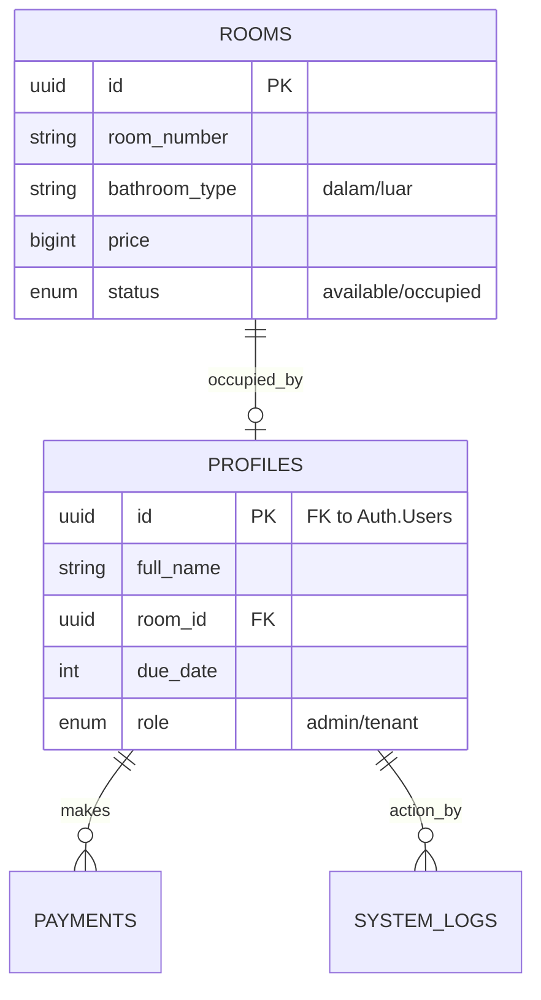

# 🏠 KosKeppel v1.0 - Project Documentation
> **Konsep:** Sistem Manajemen Kos Mandiri (Kosongan)  
> **Target:** 13 Kamar (Lt.1: 12, Lt.2: 1)  
> **Status:** Fase 1 - Perancangan Sistem

---

## 📋 1. SKPL / SRS (Software Requirements Specification)

### Kebutuhan Fungsional (FR)
- **FR-01:** Denah kamar visual (Interaktif) untuk cek ketersediaan.
- **FR-02:** Admin mendaftarkan penghuni secara manual (No Public Register).
- **FR-03:** Penghuni upload bukti bayar via web.
- **FR-04:** Fitur **Auto-Compression** untuk setiap gambar yang diupload.
- **FR-05:** Dashboard monitoring "Lunas vs Nunggak" per bulan.
- **FR-06:** Audit Log untuk mencatat setiap aktivitas Admin.

### Kebutuhan Non-Fungsional (NFR)
- **NFR-01:** Keamanan data menggunakan **Row Level Security (RLS)**.
- **NFR-02:** Biaya operasional **Rp 0** (Free Tier Vercel & Supabase).
- **NFR-03:** Responsif (Bisa dibuka lancar di HP penghuni).

---

## 🏗️ 2. Arsitektur & Desain Sistem

### Data Flow Diagram (DFD) - Level 0
1. **Guest** --> Request Data Kamar --> **Sistem** --> Tampilkan Denah Visual.
2. **Tenant** --> Kirim Bukti Bayar --> **Sistem** --> Simpan di Storage & DB.
3. **Admin** --> Verifikasi Bayar --> **Sistem** --> Update Status Kamar & Log.

### Entity Relationship Diagram (ERD) / RAT


---

## 🛠️ 3. Tech Stack Lengkap
- **Framework:** Next.js 15 (App Router) + TypeScript.
- **Database/Auth:** Supabase (PostgreSQL).
- **UI:** Tailwind CSS + Shadcn/UI + Lucide Icons.
- **Security:** UUID, RLS, Zod (Validation), Browser-Image-Compression.

---

## 🛡️ 4. Security Journal (Cybersecurity Focus)
- **Anti-IDOR:** Menggunakan UUID agar user tidak bisa menebak ID transaksi orang lain.
- **Database Hardening:** Triggers otomatis untuk menjaga konsistensi data tanpa campur tangan Frontend.
- **Privacy:** Data penghuni tidak akan di-*fetch* ke halaman Landing Page (Guest).

---

## 📅 5. Roadmap 6 Bulan

| Bulan | Fokus | Output |
| :--- | :--- | :--- |
| **1** | **Architect** | SRS, SKPL, DFD, ERD, Wireframe, Setup DB. |
| **2-3** | **Frontend** | Slicing Landing Page & Room Map (Static). |
| **4-5** | **Fullstack** | Auth, Payment Upload, Admin Dashboard, Triggers. |
| **6** | **Guardian** | Security Audit, PenTesting, Deployment (Vercel). |

---

## 🎨 6. Wireframe Concept (Simple)

### Landing Page
```text
[ Logo KosKeppel ]          [ Login ]
-------------------------------------
"Kamar Mandi Dalam: 550rb | Luar: 450rb"

[ 101 ] [ 102 ] [ 103 ] [ 104 ]  <-- Hijau/Merah
[ 105 ] [ 106 ] [ 107 ] [ 108 ]
...
```

---